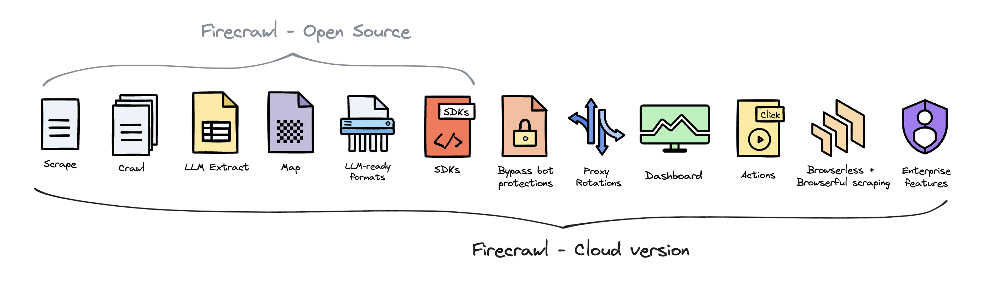

import InstallationPython from "/snippets/v1/installation/python.mdx";
import InstallationNode from "/snippets/v1/installation/js.mdx";
import InstallationGo from "/snippets/v1/installation/go.mdx";
import InstallationRust from "/snippets/v1/installation/rust.mdx";
import ScrapePython from "/snippets/v1/scrape/base/python.mdx";
import ScrapeNode from "/snippets/v1/scrape/base/js.mdx";
import ScrapeGo from "/snippets/v1/scrape/base/go.mdx";
import ScrapeRust from "/snippets/v1/scrape/base/rust.mdx";
import ScrapeCURL from "/snippets/v1/scrape/base/curl.mdx";
import ScrapeResponse from "/snippets/v1/scrape/base/output.mdx";
import CrawlPython from "/snippets/v1/crawl/base/python.mdx";
import CrawlNode from "/snippets/v1/crawl/base/js.mdx";
import CrawlGo from "/snippets/v1/crawl/base/go.mdx";
import CrawlRust from "/snippets/v1/crawl/base/rust.mdx";
import CrawlCURL from "/snippets/v1/crawl/base/curl.mdx";
import CrawlAsyncOutput from "/snippets/v1/crawl-async/base/output.mdx";
import CheckCrawlJobPython from "/snippets/v1/crawl-status/short/python.mdx";
import CheckCrawlJobNode from "/snippets/v1/crawl-status/short/js.mdx";
import CheckCrawlJobGo from "/snippets/v1/crawl-status/short/go.mdx";
import CheckCrawlJobRust from "/snippets/v1/crawl-status/short/rust.mdx";
import CheckCrawlJobCURL from "/snippets/v1/crawl-status/short/curl.mdx";
import CheckCrawlJobOutputScraping from "/snippets/v1/crawl-status/base/output-scraping.mdx";
import CheckCrawlJobOutputCompleted from "/snippets/v1/crawl-status/base/output-completed.mdx";
import ExtractCURL from "/snippets/v1/llm-extract/base/curl.mdx";
import ExtractPython from "/snippets/v1/llm-extract/base/python.mdx";
import ExtractNode from "/snippets/v1/llm-extract/base/js.mdx";
import ExtractOutput from "/snippets/v1/llm-extract/base/output.mdx";
import ExtractNoSchemaCURL from "/snippets/v1/llm-extract/no-schema/curl.mdx";
import ExtractNoSchemaOutput from "/snippets/v1/llm-extract/no-schema/output.mdx";
import ScrapeActionsPython from "/snippets/v1/scrape/actions/python.mdx";
import ScrapeActionsNode from "/snippets/v1/scrape/actions/js.mdx";
import ScrapeActionsCURL from "/snippets/v1/scrape/actions/curl.mdx";
import ScrapeActionsOutput from "/snippets/v1/scrape/actions/output.mdx";


## 欢迎使用 Firecrawl

[Firecrawl](https://firecrawl.dev?ref=github) 是一个 API 服务，它接收 URL，爬取内容，并将其转换为干净的 markdown 格式。我们会爬取所有可访问的子页面，并为每个页面提供干净的 markdown。无需站点地图。

## 如何使用？

我们提供了一个易于使用的 API 和托管版本。您可以在[这里](https://firecrawl.dev/playground)找到 playground 和文档。您也可以自行托管后端。

查看以下资源开始使用：
- [x] **API**：[文档](https://docs.firecrawl.dev/api-reference/introduction)
- [x] **SDK**：[Python](https://docs.firecrawl.dev/sdks/python)、[Node](https://docs.firecrawl.dev/sdks/node)、[Go](https://docs.firecrawl.dev/sdks/go)、[Rust](https://docs.firecrawl.dev/sdks/rust)
- [x] **LLM 框架**：[Langchain (python)](https://python.langchain.com/docs/integrations/document_loaders/firecrawl/)、[Langchain (js)](https://js.langchain.com/docs/integrations/document_loaders/web_loaders/firecrawl)、[Llama Index](https://docs.llamaindex.ai/en/latest/examples/data_connectors/WebPageDemo/#using-firecrawl-reader)、[Crew.ai](https://docs.crewai.com/)、[Composio](https://composio.dev/tools/firecrawl/all)、[PraisonAI](https://docs.praison.ai/firecrawl/)、[Superinterface](https://superinterface.ai/docs/assistants/functions/firecrawl)、[Vectorize](https://docs.vectorize.io/integrations/source-connectors/firecrawl)
- [x] **低代码框架**：[Dify](https://dify.ai/blog/dify-ai-blog-integrated-with-firecrawl)、[Langflow](https://docs.langflow.org/)、[Flowise AI](https://docs.flowiseai.com/integrations/langchain/document-loaders/firecrawl)、[Cargo](https://docs.getcargo.io/integration/firecrawl)、[Pipedream](https://pipedream.com/apps/firecrawl/)
- [x] **其他**：[Zapier](https://zapier.com/apps/firecrawl/integrations)、[Pabbly Connect](https://www.pabbly.com/connect/integrations/firecrawl/)
- [ ] 需要 SDK 或集成？请通过提交 issue 告诉我们。

**自托管：** 要自托管，请参考[此处](/contributing/self-host)的指南。

### API 密钥

要使用 API，您需要在 [Firecrawl](https://firecrawl.dev) 上注册并获取 API 密钥。

### 功能

- [**抓取**](#scraping)：抓取 URL 并获取 LLM 可用格式的内容（markdown、通过 [LLM Extract](#extraction) 获取结构化数据、截图、HTML）
- [**爬取**](#crawling)：抓取网页上的所有 URL 并以 LLM 可用格式返回内容
- [**映射**](/features/map)：输入网站并获取所有网站 URL - 速度极快

### 强大的功能
- **LLM 可用格式**：markdown、结构化数据、截图、HTML、链接、元数据
- **处理困难任务**：代理、反机器人机制、动态内容（js 渲染）、输出解析、编排
- **可定制性**：排除标签、使用自定义头信息爬取需要认证的网站、最大爬取深度等...
- **媒体解析**：PDF、docx、图像
- **可靠性优先**：设计用于获取您需要的数据 - 无论多么困难
- **操作**：在提取数据前进行点击、滚动、输入、等待等操作

您可以在我们的[文档](https://docs.firecrawl.dev)中找到 Firecrawl 的所有功能及其使用方法

## 爬取

用于爬取 URL 及其所有可访问的子页面。这会提交一个爬取任务并返回一个任务 ID，用于检查爬取状态。

### 安装

<CodeGroup>

  <InstallationPython />

  <InstallationNode />

  <InstallationGo />
  
  <InstallationRust />

</CodeGroup>

### 使用方法

<CodeGroup>

<CrawlPython />
<CrawlNode />
<CrawlGo />
<CrawlRust />
<CrawlCURL />

</CodeGroup>

如果您使用 cURL 或 SDK 中的 `async crawl` 函数，这将返回一个 `ID`，您可以用它来检查爬取状态。

<CrawlAsyncOutput />

### 检查爬取任务

用于检查爬取任务的状态并获取其结果。

<CodeGroup>

<CheckCrawlJobPython />
<CheckCrawlJobNode />
<CheckCrawlJobGo />
<CheckCrawlJobRust />
<CheckCrawlJobCURL />

</CodeGroup>

#### 响应

响应将根据爬取状态而有所不同。对于未完成或超过 10MB 的大型响应，将提供 `next` URL 参数。您必须请求此 URL 以检索下一个 10MB 的数据。如果 `next` 参数不存在，则表示爬取数据已结束。

<CodeGroup>
  <CheckCrawlJobOutputScraping />
  <CheckCrawlJobOutputCompleted />
</CodeGroup>

## 抓取

要抓取单个 URL，请使用 `scrape_url` 方法。它接受 URL 作为参数，并以字典形式返回抓取的数据。

<CodeGroup>

  <ScrapePython />

  <ScrapeNode />

  <ScrapeGo />

  <ScrapeRust />

  <ScrapeCURL />

</CodeGroup>

### 响应

SDK 将直接返回数据对象。cURL 将返回与下面完全相同的负载。

<ScrapeResponse />

## 提取

通过 LLM 提取，您可以轻松地从任何 URL 中提取结构化数据。我们还支持 pydantic 模式，使其更易于使用。以下是使用方法：

v1 目前仅支持 node、python 和 cURL。

<CodeGroup>

<ExtractPython />
<ExtractNode />
<ExtractCURL />

</CodeGroup>

输出：

<ExtractOutput />

### 无模式提取（新功能）

现在您可以通过仅向端点传递 `prompt` 来进行无模式提取。LLM 会自行选择数据结构。

<CodeGroup>

<ExtractNoSchemaCURL />

</CodeGroup>

输出：

<ExtractNoSchemaOutput />

### 提取 (v0)

<CodeGroup>
```python Python

app = FirecrawlApp(version="v0")

class ArticleSchema(BaseModel):
    title: str
    points: int 
    by: str
    commentsURL: str

class TopArticlesSchema(BaseModel):
top: List[ArticleSchema] = Field(..., max_items=5, description="Top 5 stories")

data = app.scrape_url('https://news.ycombinator.com', {
'extractorOptions': {
'extractionSchema': TopArticlesSchema.model_json_schema(),
'mode': 'llm-extraction'
},
'pageOptions':{
'onlyMainContent': True
}
})
print(data["llm_extraction"])
```

```js JavaScript
import FirecrawlApp from "@mendable/firecrawl-js";
import { z } from "zod";

const app = new FirecrawlApp<"v0">({
  apiKey: "fc-YOUR_API_KEY",
  version: "v0",
});

// Define schema to extract contents into
const schema = z.object({
  top: z
    .array(
      z.object({
        title: z.string(),
        points: z.number(),
        by: z.string(),
        commentsURL: z.string(),
      })
    )
    .length(5)
    .describe("Top 5 stories on Hacker News"),
});

const scrapeResult = await app.scrapeUrl("https://news.ycombinator.com", {
  extractorOptions: { extractionSchema: schema },
});

console.log(scrapeResult.data["llm_extraction"]);
```

```go Go
import (
  "fmt"
  "log"

  "github.com/mendableai/firecrawl-go"
)

app, err := NewFirecrawlApp(TEST_API_KEY, API_URL)
if err != nil {
  log.Fatalf("Failed to initialize FirecrawlApp: %v", err)
}

params := map[string]any{
  "extractorOptions": ExtractorOptions{
    Mode:             "llm-extraction",
    ExtractionPrompt: "Based on the information on the page, find what the company's mission is and whether it supports SSO, and whether it is open source",
    ExtractionSchema: map[string]any{
      "type": "object",
      "properties": map[string]any{
        "company_mission": map[string]string{"type": "string"},
        "supports_sso":    map[string]string{"type": "boolean"},
        "is_open_source":  map[string]string{"type": "boolean"},
      },
      "required": []string{"company_mission", "supports_sso", "is_open_source"},
    },
  },
}

scrapeResult, err := app.ScrapeURL("https://news.ycombinator.com", params)
if err != nil {
  log.Fatalf("Failed to scrape URL: %v", err)
}
fmt.Println(scrapeResult.LLMExtraction)
```

```rust Rust
use firecrawl::FirecrawlApp;

#[tokio::main]
async fn main() {
    // Initialize the FirecrawlApp with the API key
    let api_key = "YOUR_API_KEY";
    let api_url = "https://api.firecrawl.dev";
    let app = FirecrawlApp::new(api_key, api_url).expect("Failed to initialize FirecrawlApp");

    // Define schema to extract contents into
    let json_schema = json!({
        "type": "object",
        "properties": {
            "top": {
                "type": "array",
                "items": {
                    "type": "object",
                    "properties": {
                        "title": {"type": "string"},
                        "points": {"type": "number"},
                        "by": {"type": "string"},
                        "commentsURL": {"type": "string"}
                    },
                    "required": ["title", "points", "by", "commentsURL"]
                },
                "minItems": 5,
                "maxItems": 5,
                "description": "Top 5 stories on Hacker News"
            }
        },
        "required": ["top"]
    });

    let llm_extraction_params = json!({
        "extractorOptions": {
            "extractionSchema": json_schema,
            "mode": "llm-extraction"
        },
        "pageOptions": {
            "onlyMainContent": true
        }
    });

    let llm_extraction_result = app
        .scrape_url("https://news.ycombinator.com", Some(llm_extraction_params))
        .await;
    match llm_extraction_result {
        Ok(data) => println!("LLM Extraction Result:\n{}", data["llm_extraction"]),
        Err(e) => eprintln!("LLM Extraction failed: {}", e),
    }
}
```

```bash cURL
curl -X POST https://api.firecrawl.dev/v0/scrape \
    -H 'Content-Type: application/json' \
    -H 'Authorization: Bearer YOUR_API_KEY' \
    -d '{
      "url": "https://docs.firecrawl.dev/",
      "extractorOptions": {
        "mode": "llm-extraction",
        "extractionPrompt": "Based on the information on the page, extract the information from the schema. ",
        "extractionSchema": {
          "type": "object",
          "properties": {
            "company_mission": {
                      "type": "string"
            },
            "supports_sso": {
                      "type": "boolean"
            },
            "is_open_source": {
                      "type": "boolean"
            },
            "is_in_yc": {
                      "type": "boolean"
            }
          },
          "required": [
            "company_mission",
            "supports_sso",
            "is_open_source",
            "is_in_yc"
          ]
        }
      }
    }'
```

</CodeGroup>

## 通过操作与页面交互

Firecrawl 允许您在抓取网页内容之前执行各种操作。这对于与动态内容交互、在页面间导航或访问需要用户交互的内容特别有用。

以下是一个使用操作导航到 google.com，搜索 Firecrawl，点击第一个结果并截图的示例。

在执行其他操作前后使用 `wait` 操作几乎总是很重要的，这可以给页面足够的加载时间。
### 示例

<CodeGroup>

<ScrapeActionsPython />
<ScrapeActionsNode /> 
<ScrapeActionsCURL />

</CodeGroup>

### 输出

<CodeGroup>

<ScrapeActionsOutput />

</CodeGroup>

## 开源版与云版

Firecrawl 是开源的，使用 [AGPL-3.0 许可证](https://github.com/mendableai/firecrawl/blob/main/LICENSE)。

为了提供最好的产品，我们在开源版本的基础上提供了 Firecrawl 的托管版本。云解决方案使我们能够不断创新并为所有用户维护高质量、可持续的服务。

Firecrawl Cloud 可在 [firecrawl.dev](https://firecrawl.dev) 获取，并提供开源版本中不可用的一系列功能：



## 贡献

我们欢迎贡献！在提交拉取请求之前，请阅读我们的[贡献指南](https://github.com/mendableai/firecrawl/blob/main/CONTRIBUTING.md)。

